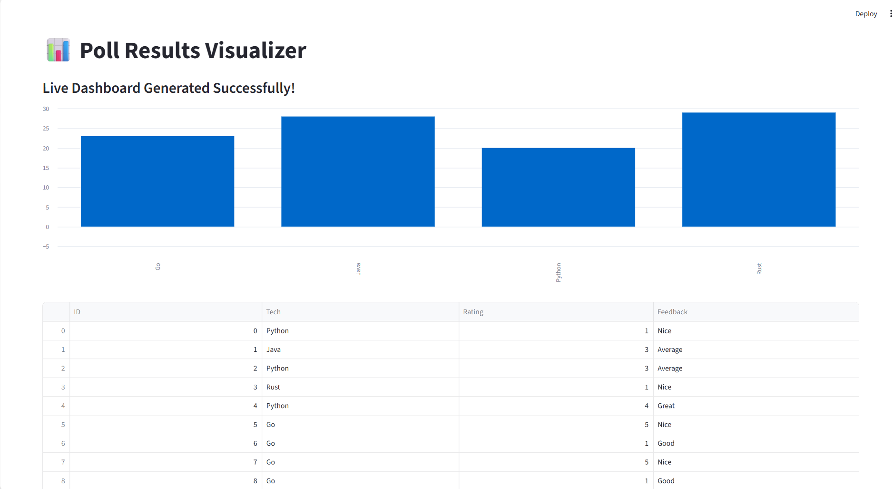

<<<<<<< HEAD

# 📊 Poll Results Visualizer

An interactive Data Science application that transforms raw poll data into meaningful visual insights. This tool uses **Streamlit** and **Plotly** to create a seamless user experience for data analysis.

## 🌟 Key Features
- **Data Ingestion:** Upload and process poll results from CSV or local sources.
- **Word Cloud Generation:** Automatically extract and visualize key themes from text-based poll responses.
- **Interactive Charts:** High-quality Bar and Pie charts for categorical data analysis.
- **Real-time Filtering:** Dynamic sidebars to filter results based on specific criteria.

## 🛠️ Tech Stack
- **UI Framework:** Streamlit
- **Visualization:** Plotly Express, WordCloud
- **Data Engine:** Pandas
- **Language:** Python 3.11+
=======
# 📊 Poll Results Visualizer

An industry-oriented survey data analytics tool that automates the cleaning and visualization of poll responses.

## 🚀 Live Demo Preview

## 🛠️ Features
- **Automated Data Generation**: Simulates 100+ respondent data.
- **Dynamic Charts**: Real-time bar charts showing technology preferences.
- **Interactive Table**: Browse through raw respondent data instantly.
- **Clean UI**: Built with Streamlit for a professional look.

## 💻 How to Run
1. Navigate to the project folder.
2. Install requirements: `pip install -r requirements.txt`
3. Run the app: `streamlit run app.py`

## ⚙️ Tech Stack
- **Python** (Pandas, Numpy)
- **Visualization**: Streamlit, Matplotlib
>>>>>>> 2ccb084 (Initial commit: Professional Poll Visualizer Dashboard)
